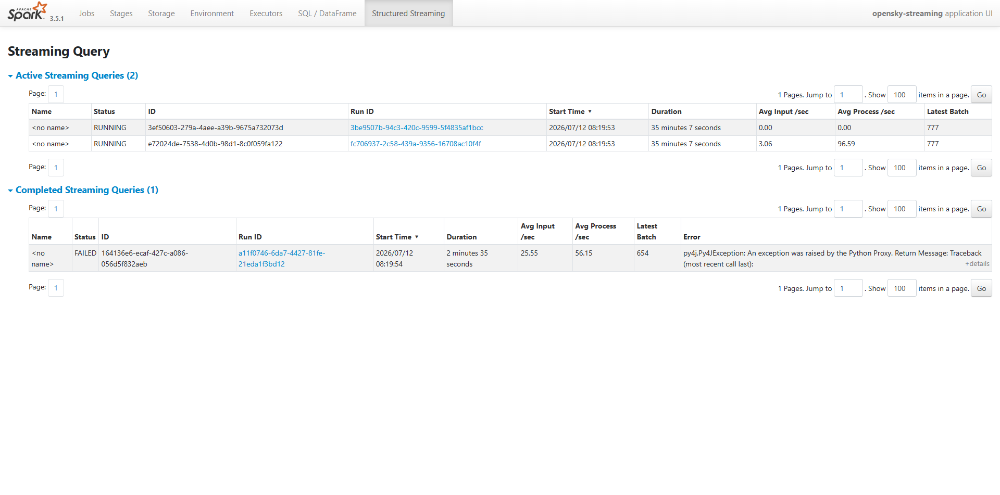
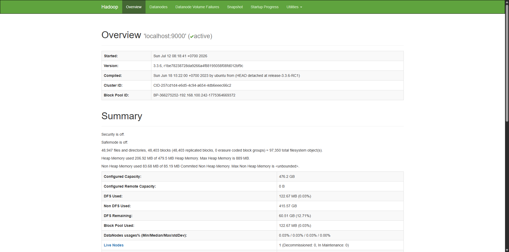
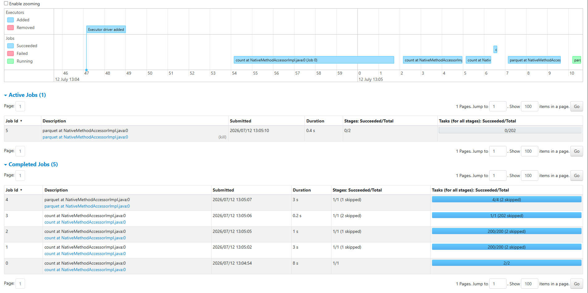
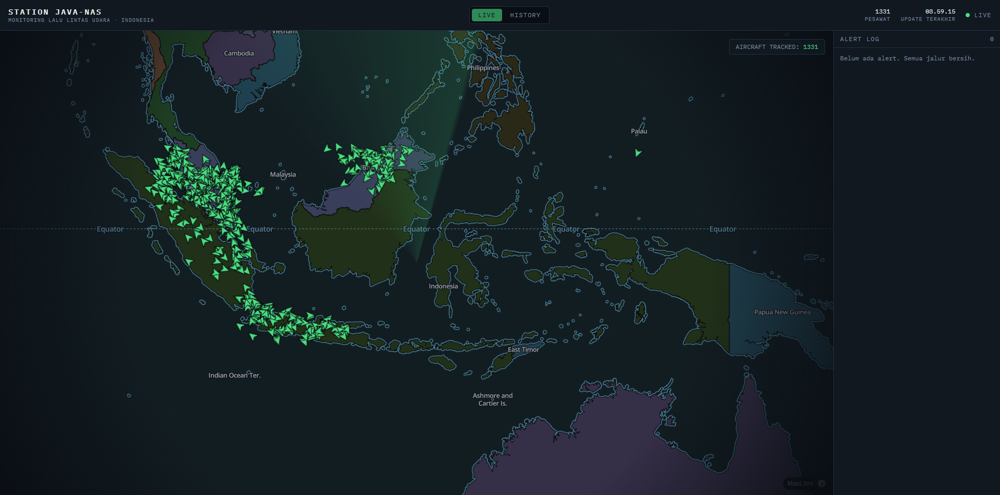
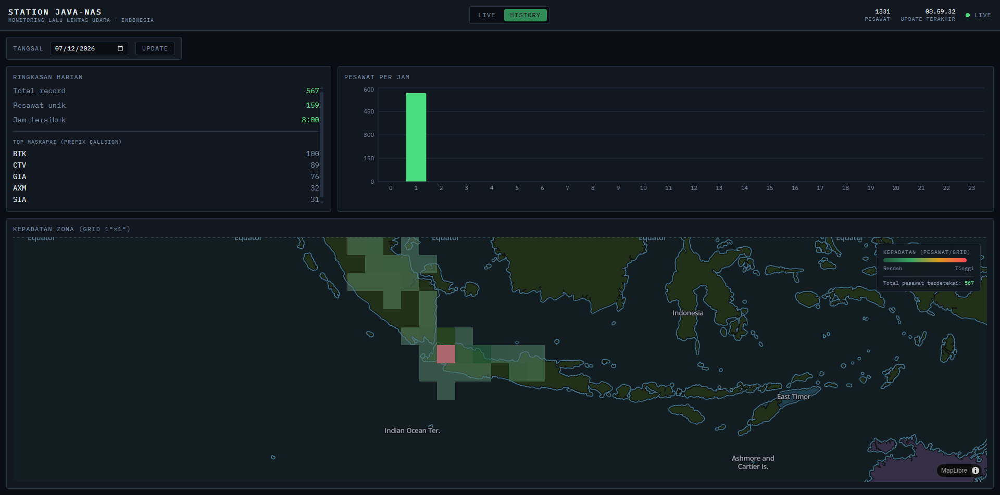
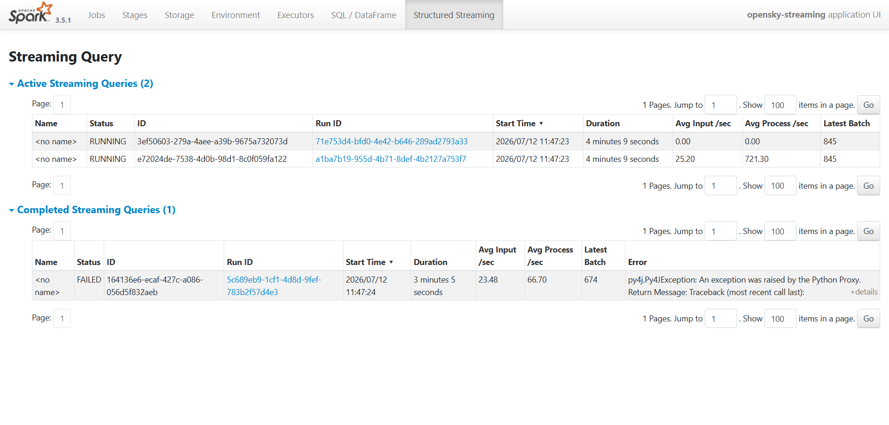
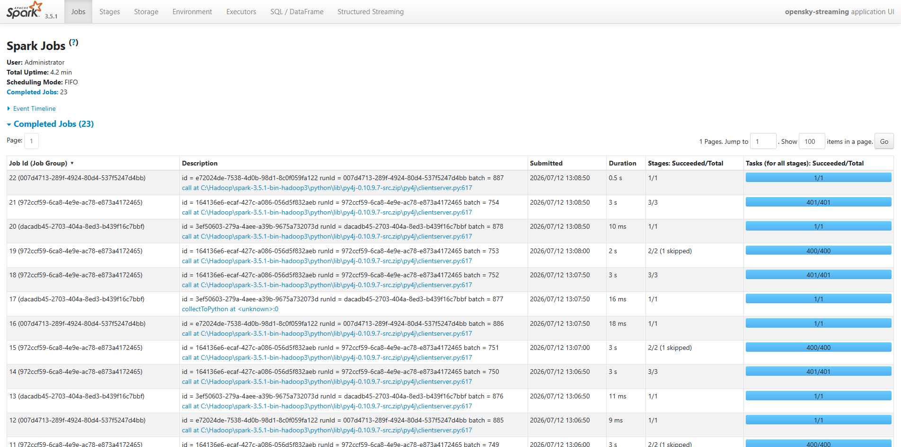

# Laporan Akhir: Monitoring Lalu Lintas Udara Indonesia Real-Time

**Mata kuliah:** Big Data
**Tanggal:** 12 Juli 2026
**Repo:** `it-infra` (backend/pipeline) + `it-infra-web` (frontend, di-subtree ke `web/`)

> Dokumen ini adalah laporan akhir yang berdiri sendiri, merangkum desain, implementasi, dan hasil validasi. Dokumen kerja lengkap (lebih detail, terus diperbarui selama pengembangan) tetap ada di `docs/design/2026-07-08-desain-infrastruktur-bigdata-lalu-lintas-udara.md` dan `docs/design/hasil-eksperimen-resiliensi.md` — laporan ini merangkum keduanya untuk dikumpulkan.

---

## 1. Latar Belakang & Rumusan Masalah

Lalu lintas udara adalah permasalahan interdisipliner: **logistik** (efisiensi rute, kepadatan bandara, konektivitas antar pulau — vital bagi negara kepulauan), **smart city** (perencanaan kapasitas bandara, kebisingan wilayah urban), dan **lingkungan** (estimasi emisi dari kepadatan penerbangan per wilayah). Indonesia memiliki salah satu ruang udara tersibuk di Asia Tenggara, dengan CGK (Soekarno-Hatta) melayani 1.000+ pergerakan pesawat per hari.

**Pertanyaan yang dijawab sistem ini:**

1. **Real-time** — Berapa jumlah dan kepadatan pesawat di ruang udara Indonesia saat ini per zona? Adakah kondisi darurat (squawk 7500/7600/7700) atau anomali kepadatan? → *jalur streaming*
2. **Historis** — Bagaimana pola kepadatan lalu lintas udara per jam/hari? Jam-jam tersibuk di sekitar bandara utama? Distribusi ketinggian & kecepatan? Maskapai/negara asal dominan? → *jalur batch*

Dua kebutuhan latensi yang berbeda (detik-menit vs jam-hari) inilah yang menjustifikasi arsitektur dengan dua jalur pemrosesan (pola Lambda).

## 2. Sumber Data

Data diambil dari **OpenSky Network** (`/api/states/all`) — jaringan crowdsourced ribuan receiver ADS-B yang menangkap sinyal transponder pesawat (data sensor/IoT, diakses lewat API publik, sesuai ketentuan tugas).

- Kuota: 4.000 kredit/hari. Bounding box **Jawa** (~40 deg², 2 kredit) di-poll tiap **60 detik**; snapshot **seluruh Indonesia** (~780 deg², 4 kredit) tiap **15 menit**. Total ≈ 3.264/4.000 kredit/hari.
- Volume: ±50-150 pesawat/snapshot Jawa × ~1.440 snapshot/hari ≈ **70.000-220.000 record/hari**.
- Fallback offline: `replay.py` memutar ulang rekaman mentah yang tersimpan, untuk demo saat internet/kuota bermasalah.

## 3. Arsitektur (Pola Lambda)

```
AKUISISI
  OpenSky API -> ingest.py (poller 2-tier: Jawa/60dtk, Indonesia/15mnt)
                    |
                    +--> HDFS raw/dt=.../*.json (arsip, schema-on-read)
                    +--> Kafka topic opensky.states (KRaft, 3 partisi,
                         key=icao24 -- lihat §3.1 migrasi)

PEMROSESAN
  BATCH  : batch_job.py (PySpark, harian) -> flatten + dedup + agregasi
           (kepadatan grid, jam tersibuk, distribusi altitude/velocity,
           top maskapai) -> Parquet HDFS curated + snapshot MongoDB
  STREAM : streaming_job.py (Spark Structured Streaming, Kafka source)
           -> windowed agg 2 menit per zona (watermark 1 menit) +
           deteksi alert (squawk darurat, lonjakan kepadatan) ->
           upsert MongoDB, checkpoint ke HDFS
           (kedua job jalan local[*] - lihat §6 soal migrasi YARN)

SERVING & VISUALISASI
  api/ (FastAPI): WebSocket /ws/live (forward MongoDB change stream),
                  REST /api/history/* (baca Parquet curated)
  web/ (React + deck.gl/MapLibre): peta live via WebSocket push,
                  panel historis (heatmap, tren) via REST, panel alert
```

**Alur ringkas:** `ingest.py` menulis raw JSON ke HDFS + tiap pesawat sebagai 1 pesan ke Kafka topic `opensky.states` → batch job mengagregasi seluruh raw zone harian menjadi Parquet curated → streaming job mengonsumsi Kafka topic secara kontinu, mengagregasi window 2 menit ke MongoDB → FastAPI menjembatani MongoDB (live, via change stream + WebSocket) dan Parquet (historis, via REST) ke dashboard React.

### 3.1 Migrasi transport streaming: file lokal → Kafka

Prototipe awal memakai folder lokal `landing_stream/` (NDJSON) sebagai transport antara `ingest.py` dan `streaming_job.py` — cukup untuk jalur streaming yang berdiri sendiri, tapi tidak punya buffering/replay kalau consumer berhenti sesaat. Pada 2026-07-12, transport ini dimigrasikan ke **Kafka** (native Windows, mode KRaft tanpa ZooKeeper, topic `opensky.states`, 3 partisi, replication-factor 1). Format payload JSON per pesan **tidak berubah** dari kontrak NDJSON lama (lihat `docs/design/CONTRACTS.md` §C1) — hanya medium transportnya yang berubah. Detail keputusan: `docs/design/2026-07-12-kafka-migration-design.md`.

**Validasi migrasi (setara Task 4 rencana migrasi):** dibandingkan offset topik Kafka (`kafka-get-offsets.bat`, total across 3 partisi) dengan pertambahan dokumen di MongoDB pada window ~2 menit — pesan yang diproduksi `ingest.py` bertambah konsisten (append-only, tidak ada gap), tidak ditemukan indikasi pesan hilang di level broker maupun duplikasi pemrosesan di `live_states` (upsert-by-`icao24` tetap konsisten).

## 4. Justifikasi Pemilihan Platform

| Kebutuhan | Pilihan | Alasan utama |
|---|---|---|
| Data lake | **HDFS** | Replikasi & fault tolerance bawaan, data locality dengan Spark |
| Format curated | **Parquet** | Kolumnar, kompresi baik, predicate pushdown |
| NoSQL serving | **MongoDB** | Upsert + TTL index native (pas untuk state live yang kedaluwarsa), change stream untuk push realtime |
| Batch | **Spark (PySpark)** | In-memory, jauh lebih cepat dari MapReduce, API DataFrame ekspresif |
| Streaming | **Spark Structured Streaming** | Satu engine dengan batch, exactly-once via checkpoint+WAL |
| Resource manager Spark | **`local[*]`** (bukan YARN) | Migrasi ke YARN **dicoba dan dibatalkan** — bug classpath-jar di Hadoop 3.3.6-on-Windows (`{{PWD}}`/`<CPS>` tidak ter-expand), dikonfirmasi 5 percobaan independen. YARN tetap dipakai lewat **MapReduce native** untuk job pembanding `density_grid_hourly`, membuktikan YARN sendiri sehat — hanya jalur classpath-builder Spark yang bermasalah |
| Transport streaming | **Kafka** (native Windows, KRaft) | Awalnya file source lokal (cukup untuk prototipe berdiri sendiri), dimigrasikan ke Kafka 2026-07-12 untuk buffering & replay saat consumer sempat berhenti — lihat §3.1 |
| Serving API | **FastAPI** | Async native untuk WebSocket + MongoDB change stream |
| Dashboard | **React (Vite) + deck.gl/MapLibre** | Update realtime via WebSocket push tanpa refresh; deck.gl efisien merender ratusan marker bergerak |

## 5. Demo & Bukti Visual

### 5.1 Jalur Streaming (M1)

Streaming job berjalan sehat, ketiga query (`live_states`, `zone_stats`, `alerts`) `RUNNING`, terus memproses micro-batch dari Kafka topic `opensky.states` ke MongoDB.



### 5.2 HDFS (penyimpanan)



### 5.3 Jalur Batch (M3)

`batch_job.py` dijalankan atas data harian; DAG job terlihat di Spark UI.



### 5.4 Dashboard — peta live & historis (M2)

Peta menampilkan pesawat riil di atas Indonesia, bergerak via WebSocket push tanpa refresh halaman.



Tab historis menampilkan heatmap kepadatan dan ringkasan harian dari data batch.



## 6. Validasi Resiliensi (Eksperimen Chaos)

Tiga eksperimen chaos dijalankan sungguhan (bukan tabletop) di lab, blast radius = 0 pengguna eksternal. Detail penuh (log, angka, MTTR) ada di `docs/design/hasil-eksperimen-resiliensi.md`.

### Eksperimen 1 — Kill DataNode saat batch job

**Hipotesis:** job selesai bila replikasi ≥2; pada replikasi 1 (setup lab ini) job gagal.

**Hasil: TERBUKTI.** `batch_job.py` gagal total (`SparkException: Job aborted`, `No live nodes contain block`) begitu satu-satunya DataNode mati. Setelah DataNode direstart (`hdfs.cmd datanode`, bukan `--daemon` yang tidak didukung di Windows), `fsck` kembali HEALTHY dan re-run batch sukses total (exit code 0, 2287 baris bersih, 389 pesawat unik). **MTTR teknis ~20 detik.**

### Eksperimen 2 — Latensi/error di ingest

**Hipotesis:** streaming lanjut, latensi naik gracefully, tidak ada record hilang setelah pulih.

**Hasil: TERBUKTI.** Dengan `CHAOS_LATENCY_S=5` + `CHAOS_ERROR_RATE=0.2` selama ~6 menit, Structured Streaming tetap `RUNNING` sepanjang injeksi; `live_states` naik wajar (1358→1418), tidak ada indikasi data hilang. Retry+backoff bawaan (2/4/8 detik) cukup menyerap error rate transient sampai 20%.



### Eksperimen 3 — Kill proses streaming

**Hipotesis:** maksimal 1 micro-batch tertunda; recovery dari checkpoint tanpa duplikat.

**Hasil: TERBUKTI.** Setelah `taskkill` proses `SparkSubmit` dan restart `spark-submit src\streaming_job.py`, ketiga query Structured Streaming melanjutkan **Query ID yang sama** (bukan membuat query baru) dan Latest Batch lanjut dari checkpoint (689/853/853 → 691/854/854). Tidak ada duplikat di `live_states` (distinct `_id` == total dokumen, berkat upsert-by-`icao24`). **MTTR teknis ~3 menit 39 detik.**



### Temuan sampingan (dilaporkan secara jujur, di luar scope 3 eksperimen terencana)

- `ingest.py` sempat berhenti menulis file baru ke `landing_stream/` selama ~26 menit tanpa exception apa pun di log, lalu pulih sendiri tanpa intervensi — kemungkinan hang diam-diam di panggilan HTTP/OAuth, belum dikonfirmasi root cause-nya.
- **Duplikasi dokumen `alerts` (density_spike):** ditemukan saat validasi migrasi Kafka (§3.1) — koleksi `alerts` bisa berisi beberapa dokumen dengan `(type, icao24, zone, ts)` identik. Akar masalah: Query 2 (`zone_stats`) pakai `outputMode("update")`, jadi selama window 2 menit masih terbuka, agregat zona yang sama ter-emit ulang tiap trigger (10 detik) — `zone_stats` sendiri aman (upsert by `{zone}_{window_start}`), tapi insert alert `density_spike` di batch yang sama memakai `insert_many` tanpa dedup key, jadi kondisi spike yang tetap `True` di beberapa trigger berturut-turut menghasilkan alert duplikat. Bug ini independen dari transport (Kafka maupun file source lama sama-sama kena), lebih kentara saat polling dipercepat (lebih banyak trigger per window terbuka). Perbaikan yang disarankan: upsert alert `density_spike` dengan key `{type}_{zone}_{window_start}`, sama seperti pola `zone_stats` — belum diimplementasikan.

## 7. Keterbatasan & Desain Produksi

| Aspek | Prototipe | Produksi |
|---|---|---|
| Akuisisi | Polling REST, kuota 4.000 kredit/hari | Feed ADS-B langsung / lisensi komersial, receiver sendiri |
| Transport streaming | **Kafka** single broker, replication-factor 1 | Kafka cluster multi-broker, replication-factor ≥3 (toleran kehilangan broker) |
| Cluster | Single-node, Spark `local[*]`, replikasi HDFS 1 | Multi-node YARN/Kubernetes, replikasi ≥3, HA NameNode/ResourceManager |
| Orkestrasi | Windows Task Scheduler / skrip | Airflow (dependensi, retry, SLA, backfill) |
| Keamanan | Kredensial di config lokal | Kerberos/Ranger, TLS, secret manager |
| Monitoring | Spark UI manual | Prometheus + Grafana, alerting |

**Catatan migrasi YARN:** dicoba 2026-07-11 untuk Spark (`batch_job.py`/`streaming_job.py`) dan **dibatalkan permanen** — bug genuine Hadoop 3.3.6-on-Windows (classpath-jar tidak meng-expand token `{{PWD}}`/`<CPS>`), dikonfirmasi lewat 5 percobaan independen, bukan bug di kode/config project ini. Sebagai gantinya, YARN tetap dipakai lewat **MapReduce native (Hadoop Streaming)** untuk job pembanding `density_grid_hourly` — terbukti sukses (217 map task + 1 reduce task), membuktikan YARN di mesin ini sehat dan hanya jalur Spark-on-YARN yang bermasalah. Detail lengkap di `docs/design/2026-07-11-yarn-migration-design.md`.

## 8. Ringkasan Pemenuhan Ketentuan Tugas

| Ketentuan | Dipenuhi oleh |
|---|---|
| Akuisisi data (tanpa IoT fisik) | OpenSky Network API — data transponder pesawat real-time (§2) |
| Penyimpanan HDFS | Data lake raw + curated (§3) |
| Penyimpanan NoSQL | MongoDB serving layer (§3) |
| Pemrosesan batch Spark | `batch_job.py` — kepadatan, pola temporal, statistik (§3, §5) |
| Structured Streaming | `streaming_job.py` — windowed agg + alert darurat/anomali (§3, §5) |
| Visualisasi | Dashboard React (WebSocket realtime): peta live + historis + alert (§5) |
| Validasi resiliensi | 3 eksperimen chaos, semua hipotesis terbukti (§6) |
| Dokumen desain arsitektur | `docs/design/2026-07-08-desain-infrastruktur-bigdata-lalu-lintas-udara.md` |
| Justifikasi platform | §4 (+ §7 jalur produksi) |
| Prototipe berjalan end-to-end | §5, `scripts/demo.ps1` |

## Lampiran — Dokumen Pendukung

- `docs/design/2026-07-08-desain-infrastruktur-bigdata-lalu-lintas-udara.md` — dokumen desain arsitektur lengkap
- `docs/design/2026-07-12-kafka-migration-design.md` & `docs/plans/2026-07-12-kafka-migration.md` — desain & rencana migrasi transport streaming ke Kafka (§3.1)
- `docs/design/hasil-eksperimen-resiliensi.md` — log lengkap 3 eksperimen chaos (angka mentah, output terminal)
- `docs/design/slide-outline.md` — outline slide presentasi
- `docs/plans/2026-07-08-rencana-implementasi-opensky-pipeline.md` — rencana implementasi & checklist milestone
- `scripts/demo.ps1` — skrip demo end-to-end (±15 menit)
- `reports/screenshots/` — semua screenshot mentah (resolusi penuh)
